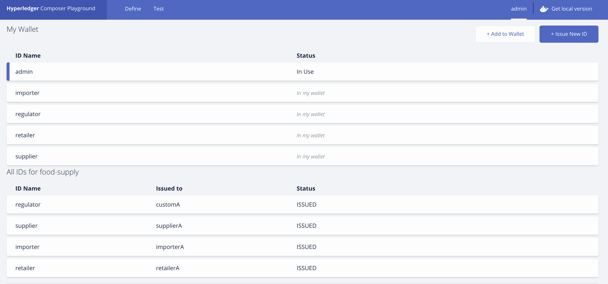

# BlockchainPublicRegulationFabric-Food

In this journey, we will create a Public Regulation Fabric example the Food Industry. Supplier transfers the food products to an importer who verifies that the supplier, country, and food type all match with the correct identifiers. At import, the supplier is checked against a list of known suppliers in a database (managed by the regulator). If the supplier is identified as exempt, a type of exemption (identified by the orgId) submitted to the regulator and the products are then transferred to the retailer. If the supplier is identified as not exempt, the products are checked against a list of known food products in the database (managed by the regulator). The food product is transferred to the retailer if the food is identified as exempt. If the food is identified as not exempt, the importer must conduct a harms analysis (either independently, or using a third party). Attestation of the harms analysis is provided to the regulator. Regulator captures the attestation of compliance and transfers the products to the retailer.

This business network defines:

**Participants:**
`Supplier` `Importer` `Retailer` `Regulator`

**Assets:**
`ProductListingContract`

**Transactions:**
`createProductListing` `transferListing` `checkProducts` `updateExemptedList`

The `createProductListing` function is called when an `createProductListing` transaction is submitted. The logic allows a supplier to create a `ProductListingContract` asset.

The `transferListing` function is called when a `transferListing` transaction is submitted by the owner of `ProductListingContract`. It is submitted either by `Supplier` to transfer `ProductListingContract` to `Importer` or by `Importer` to transfer `ProductListingContract` to `Retailer` when the exempt check for the products is completed.

The `checkProducts` function is called when a `checkProducts` transaction is submitted by the `Supplier` to perform the exempt check for the products present in the `ProductListingContract`. The status of `ProductListingContract` contract will change to `CHECKCOMPLETED` if all all the products are exempted else the status will change to `HAZARDANALYSISCHECKREQ`. `HAZARDANALYSISCHECKREQ` means the `Supplier` needs to provide Hazard Analysis report for the products. After submitting the report `Supplier` performs the `checkProducts` transaction to complete the exempt check for the products.

The `updateExemptedList` function is called when a `updateExemptedList` transaction is submitted by the `Regulator` to update the list of exempted Orgs ids and Product ids.

## Included Components
* Hyperledger Fabric
* Hyperledger Composer

## Included technologies
* Blockchain
* Containers
* Cloud

## Application Workflow Diagram


Creating multiple participants and adding ACL
* Adding additional participants
* Adding Access Control Lists
* Performing transactions

## Steps
1. [Generate the Business Network Archive (BNA)](#1-generate-the-business-network-archive-bna)
2. [Deploy the Business Network Archive using Composer Playground](#2-deploy-the-business-network-archive-using-composer-playground)
3. [Deploy the Business Network Archive on Hyperledger Composer running locally](#3-deploy-the-business-network-archive-on-hyperledger-composer-running-locally)


## 1. Generate the Business Network Archive (BNA)

To check that the structure of the files is valid, you can now generate a Business Network Archive (BNA) file for your business network definition. The BNA file is the deployable unit -- a file that can be deployed to the Composer runtime for execution.

Use the following command to generate the network archive:
```bash
npm install
```
You should see the following output:
```bash
Creating Business Network Archive

Looking for package.json of Business Network Definition
	Input directory: /Users/ishan/Documents/git-demo/BlockchainPublicRegulationFabric-Food

Found:
	Description: Sample food supplier verification network
	Name: food-supply
	Identifier: food-supply@0.0.1

Written Business Network Definition Archive file to
	Output file: ./dist/food-supply.bna

Command succeeded
```
The `composer archive create` command has created a file called `food-supply.bna` in the `dist` folder.

You can test the business network definition against the embedded runtime that stores the state of 'the blockchain' in-memory in a Node.js process.
From your project working directory, open the file test/foodTest.js and run the following command:
```
npm test
```
You should see the following output :
```
> food-supply@0.0.1 test /Users/ishan/Documents/git-demo/BlockchainPublicRegulationFabric-Food
> mocha --recursive

  FoodSupply - Test
    #FSVP
      ✓ Create Participants (185ms)
      ✓ Transfer ProductListing to Importer
      ✓ Exempt Check for ProductListing (41ms)
      ✓ Transfer ProductListing to Retailer (56ms)

  4 passing (1s)
```

## 2. Deploy the Business Network Archive using Composer Playground
Open [Composer Playground](http://composer-playground.mybluemix.net/), by default the Basic Sample Network is imported.
If you have previously used Playground, be sure to clear your browser local storage by running `localStorage.clear()` in your browser Console.

Now import the `food-supply.bna` file and click on deploy button.
<p align="center">
  
</p>

>You can also setup [Composer Playground locally](https://hyperledger.github.io/composer/installing/using-playground-locally.html).

You will see the following:
<p align="center">
  
</p>

To test your Business Network Definition, first click on the **Test** tab:

In the `Supplier` participant registry, create a new participant. Make sure you click on the `Supplier` tab on the far left-hand side first and click on `Create New Participant` button.
<p align="center">
  
</p>

```
{
  "$class": "composer.food.supply.Supplier",
  "supplierId": "supplierA",
  "countryId": "UK",
  "orgId": "ACME"
}
```

Similarly create retailer, regulator, importer participants by selecting the respective tabs.
```
{
  "$class": "composer.food.supply.Retailer",
  "retailerId": "retailerA",
  "products": []
}
```

```
{
  "$class": "composer.food.supply.Regulator",
  "regulatorId": "customA",
  "location": "SF",
  "exemptedOrgIds": ["ACME","XYZ CORP"],
  "exemptedProductIds": ["prodA","prodB"]
}
```

```
{
  "$class": "composer.food.supply.Importer",
  "importerId": "importerA"
}
```

Now we are ready to add **Access Control**. Do this by first clicking on the `admin` tab to issue **new ids** to the participants and add the ids to the wallet.
Please follow the instructions as shown in the images below:


Click on  `Issue New Id` button to create new Ids.


Click on `Add to my Wallet` link to add the newly generated Id to the `Wallet`.




Select the `Supplier id` from `Wallet tab` tab. Now click on the `test tab` to perform `createProductListing` and `transferListing` transactions.


Now click on `Submit Transaction` button and select `createProductListing` transaction from the dropdown, to create a product listing for the list of products. `products` array element contains information about the `productid` and `quantity` separated by `,`.

```
{
  "$class": "composer.food.supply.createProductListing",
  "products": ["prodA,5","prodB,2"],
  "user": "resource:composer.food.supply.Supplier#supplierA"
}
```

After executing the transaction successfully, `productListing` will be created in `ProductListingContract` registry.


Similarly, submit a `transferListing` transaction to transfer the productListing to `Importer`.
> `ProductListingContractID`is the id of the ProductListingContract copied from the `ProductListingContract` registry.

```
{
  "$class": "composer.food.supply.transferListing",
  "ownerType": "supplier",
  "newOwner": "resource:composer.food.supply.Importer#importerA",
  "productListing": "resource:composer.food.supply.ProductListingContract#<ProductListingContractID>"
}
```

`importerA` will be the owner of `ProductListingContract` and the status will be `EXEMPTCHECKREQ`. Also, productListing will be removed from `Supplier` view. Now select the `importer` id from the `Wallet tab` and submit `checkProducts` transaction to perform the exempt check for the products.

```
{
  "$class": "composer.food.supply.checkProducts",
  "regulator": "resource:composer.food.supply.Regulator#customA",
  "productListing": "resource:composer.food.supply.ProductListingContract#<ProductListingContractID>"
}
```

Successful execution of transaction will change the status of productListing to `CHECKCOMPLETED`. Now perform `transferListing` transaction to transfer the products to retailer.

```
{
  "$class": "composer.food.supply.transferListing",
  "ownerType": "importer",
  "newOwner": "resource:composer.food.supply.Retailer#retailerA",
  "productListing": "resource:composer.food.supply.ProductListingContract#<ProductListingContractID>"
}
```

The transaction will the change the owner of `ProductListingContract` and update the list of products in `Retailer` registry. Select the `Retailer` id from the `Wallet tab` and view the updated registries.


> You can also use the default `System user` to perform all the actions as we have a rule in `permissions.acl` to permit all access `System user`.

## 3. Deploy the Business Network Archive on Hyperledger Composer running locally

Please start the local Fabric using the [instructions](https://github.com/IBM/BlockchainNetwork-CompositeJourney#2-starting-hyperledger-fabric).
Now change directory to the `dist` folder containing `food-supply.bna` file and type:
```
cd dist
composer network deploy -a food-supply.bna -p hlfv1 -i PeerAdmin -s <randomString>
```

After sometime time business netwokr should be deployed to the local Hyperledger Fabric. You should see the output as follows:
```
Deploying business network from archive: food-supply.bna
Business network definition:
	Identifier: food-supply@0.0.1
	Description: Sample food supplier verification network

✔ Deploying business network definition. This may take a minute...


Command succeeded
```

You can verify that the network has been deployed by typing:
```
composer network ping -n food-supply -p hlfv1 -i admin -s adminpw
```

To create the REST API we need to launch the `composer-rest-server` and tell it how to connect to our deployed business network.
Now launch the server by changing directory to the `BlockchainPublicRegulationFabric-Food` folder and type:
```bash
cd ..
composer-rest-server
```

Answer the questions posed at startup. These allow the composer-rest-server to connect to Hyperledger Fabric and configure how the REST API is generated.
```
  _   _                                 _              _                                  ____                                                         
 | | | |  _   _   _ __     ___   _ __  | |   ___    __| |   __ _    ___   _ __           / ___|   ___    _ __ ___    _ __     ___    ___    ___   _ __
 | |_| | | | | | | '_ \   / _ \ | '__| | |  / _ \  / _` |  / _` |  / _ \ | '__|  _____  | |      / _ \  | '_ ` _ \  | '_ \   / _ \  / __|  / _ \ | '__|
 |  _  | | |_| | | |_) | |  __/ | |    | | |  __/ | (_| | | (_| | |  __/ | |    |_____| | |___  | (_) | | | | | | | | |_) | | (_) | \__ \ |  __/ | |   
 |_| |_|  \__, | | .__/   \___| |_|    |_|  \___|  \__,_|  \__, |  \___| |_|             \____|  \___/  |_| |_| |_| | .__/   \___/  |___/  \___| |_|   
          |___/  |_|                                       |___/                                                    |_|                                
? Enter your Fabric Connection Profile Name: hlfv1
? Enter your Business Network Identifier : food-supply
? Enter your Fabric username : admin
? Enter your secret: adminpw
? Specify if you want namespaces in the generated REST API: never use namespaces
? Specify if you want the generated REST API to be secured: No

To restart the REST server using the same options, issue the following command:
   composer-rest-server -p hlfv1 -n food-supply -i admin -s adminpw -N never

Discovering types from business network definition ...
Discovered types from business network definition
Generating schemas for all types in business network definition ...
Generated schemas for all types in business network definition
Adding schemas for all types to Loopback ...
Added schemas for all types to Loopback
Web server listening at: http://localhost:3000
Browse your REST API at http://localhost:3000/explorer
```
**Test REST API**
If the composer-rest-server started successfully you should see these two lines are output:
```
Web server listening at: http://localhost:3000
Browse your REST API at http://localhost:3000/explorer
```

Open a web browser and navigate to http://localhost:3000/explorer

You should see the LoopBack API Explorer, allowing you to inspect and test the generated REST API. Follow the instructions to test Business Network Definition as mentioned above in the composer section.


## Additional Resources
* [Hyperledger Fabric Docs](http://hyperledger-fabric.readthedocs.io/en/latest/)
* [Hyperledger Composer Docs](https://hyperledger.github.io/composer/introduction/introduction.html)

## License
[Apache 2.0](LICENSE)
