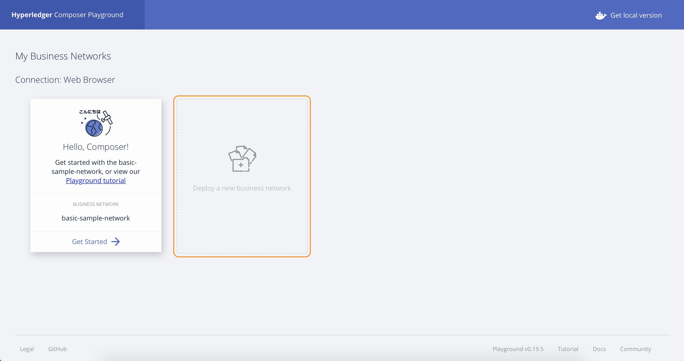
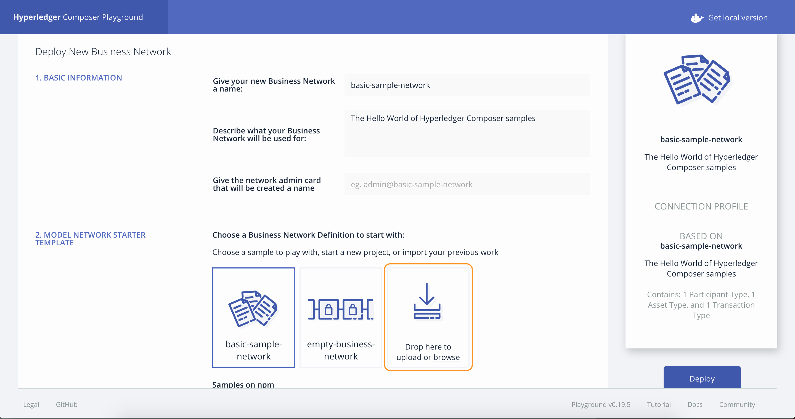
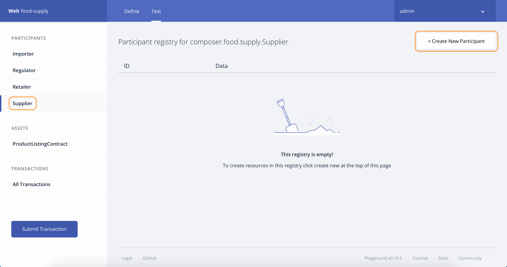

# BlockchainPublicRegulationFabric-Food

In this journey, we capture the regulatory compliance logic for the Food Supplier Verification Program in a smart contract deployed on a business network.

This business network defines:

**Participants:**
`Supplier` `Importer` `Retailer` `Regulator`

**Assets:**
`ProductListingContract`

**Transactions:**
`createProductListing` `transferListing` `checkProducts` `updateExemptedList`

Initially, the supplier will transfer the food products to an importer who verifies whether the supplier, country, and food type all match with the correct identifiers. At port of entry, the supplier is checked against a list of known suppliers in a database (managed by the regulator). If the supplier is of type exempt, then the products are then transferred to the retailer. If the supplier is of type non-exempt, then the products are checked against a list of known food products in the database (managed by the regulator). If the food is exempt product then transfer it to the retailer. If the food is a non-exempt product, the importer must conduct a harms analysis (either independently, or using a third-party). The supplier provides the harms analysis report to the regulator. The regulator reviews compliance attestation and transfers the products to the retailer.

The `createProductListing` function is called when an `createProductListing` transaction is submitted. The logic allows a supplier to create a `ProductListingContract` asset.

The `transferListing` function is called when a `transferListing` transaction is submitted by the owner of `ProductListingContract`. It is submitted either by `Supplier` to transfer `ProductListingContract` to `Importer` or by `Importer` to transfer `ProductListingContract` to `Retailer` when the exempt check for the products is completed.

The `checkProducts` function is called when a `checkProducts` transaction is submitted by the `Supplier` to perform the exempt check for the products present in the `ProductListingContract`. The status of `ProductListingContract` contract will change to `CHECKCOMPLETED` if  all the products are exempted else the status will change to `HAZARDANALYSISCHECKREQ`. `HAZARDANALYSISCHECKREQ` means the `Supplier` needs to provide Hazard Analysis report for the products. After submitting the report `Supplier` performs the `checkProducts` transaction to complete the exempt check for the products.

The `updateExemptedList` function is called when a `updateExemptedList` transaction is submitted by the `Regulator` to update the list of exempted Orgs ids and Product ids.

Audience level : Intermediate Developers

If you have an IBM cloud lite account, you can also use the Starter Plan for 30 days to do this pattern.

## Included Components
* Hyperledger Fabric
* Hyperledger Composer

## Included technologies
* Blockchain
* Containers
* Cloud

## Application Workflow Diagram


* Install Hyperledger Composer development tools
* Configure and start Hyperledger Fabric network
* Generate the Business Network Archive file
* Deploy the Business Network Archive using Composer Playground
* (Alternative method) Deploy the Business Network Archive on Hyperledger Composer running locally

## Prerequisites
We find that Blockchain can be finicky when it comes to installing Node. We want to share this [StackOverflow response](https://stackoverflow.com/questions/49744276/error-cannot-find-module-api-hyperledger-composer) - because many times the errors you see with Composer are derived in having installed either the wrong Node version or took an approach that is not supported by Composer: 

* [Docker](https://www.docker.com/products/overview) - v1.13 or higher
* [Docker Compose](https://docs.docker.com/compose/overview/) - v1.8 or higher
* [NPM](https://www.npmjs.com/get-npm) - v5.6.0 or higher
* [nvm]() - v8.11.3 (use to download and set what node version you are using)
* [Node.js](https://nodejs.org/en/download/) - node v8.11.3 ** don't install in SUDO mode
* [Git client](https://git-scm.com/downloads) - v 2.9.x or higher
* [Python](https://www.python.org/downloads/) - 2.7.x

## Steps

1. [Installing Hyperledger Composer Development Tools](#1-installing-hyperledger-composer-development-tools)
2. [Configure and start Hyperledger Fabric network](#2-starting-hyperledger-fabric)
3. [Generate the Business Network Archive (BNA)](#3-generate-the-business-network-archive-bna)
4. [Deploy the Business Network Archive using Composer Playground](#4-deploy-the-business-network-archive-using-composer-playground)
5. [Deploy the Business Network Archive on Hyperledger Composer running locally](#5-deploy-the-business-network-archive-on-hyperledger-composer-running-locally)


## 1. Installing Hyperledger Composer Development Tools

**Note:** You may need to run these commands in superuser `sudo` mode. `sudo` allows a permitted user to execute a command as the superuser or another user, as specified by the security policy. Additionally, you will be installing the latest version of composer-cli (0.19.5).  If you have an older version installed, go ahead and remove it by using the command:

```
npm uninstall -g composer-cli
```

* The `composer-cli` contains all the command line operations for developing business networks. To install `composer-cli` run the following command:
```
npm install -g composer-cli@0.19.5
```

* The `generator-hyperledger-composer` is a Yeoman plugin that creates bespoke (e.g. customized) applications for your business network. Yeoman is an open source client-side development stack, consisting of tools and frameworks intended to help developers build web applications. To install `generator-hyperledger-composer` run the following command:
```
npm install -g generator-hyperledger-composer@0.19.5
```

* The `composer-rest-server` uses the Hyperledger Composer LoopBack Connector to connect to a business network, extract the models and then present a page containing the REST APIs that have been generated for the model. To install `composer-rest-server` run the following command:
```
npm install -g composer-rest-server@0.19.5
```

* When combining `Yeoman` with the `generator-hyperledger-composer` component, it can interpret business networks and generate applications based on them. To install `Yeoman` run the following command:
```
npm install -g yo@2.0.0
```

## 2. Configure and start Hyperledger Fabric network

First download the docker files for Fabric in preparation for creating a Composer profile.  Hyperledger Composer uses Connection Profiles to connect to a runtime. A Connection Profile is a JSON document that lives in the user's home directory (or may come from an environment variable) and is referenced by name when using the Composer APIs or the Command Line tools. Using connection profiles ensures that code and scripts are easily portable from one runtime instance to another.

The PeerAdmin card is a special ID card used to administer the local Hyperledger Fabric. In a development installation, such as the one on your computer, the PeerAdmin ID card is created when you install the local Hyperledger Fabric.


First, clone the contents of this repo locally and cd into the project folder by running these commands:

```bash
git clone https://github.com/IBM/BlockchainPublicRegulationFabric-Food.git
cd BlockchainPublicRegulationFabric-Food
```

Create a directory `fabric-dev-servers` and, get the .tar.gz file that contains the tools to install Hyperledger Fabric:

```bash
mkdir ./fabric-dev-servers && cd ./fabric-dev-servers

curl -O https://raw.githubusercontent.com/hyperledger/composer-tools/master/packages/fabric-dev-servers/fabric-dev-servers.tar.gz
tar -xvf fabric-dev-servers.tar.gz
```

Then, start the Fabric and create a PeerAdmin card using the following commands:
```bash
./downloadFabric.sh
./startFabric.sh
./createPeerAdminCard.sh
```  

No need to do it now; however as an fyi - you can stop and tear down Fabric using:
```
./stopFabric.sh
./teardownFabric.sh
```


## 3. Generate the Business Network Archive (BNA)

To check that the structure of the files is valid, you can now generate a Business Network Archive (BNA) file for your business network definition. The BNA file is the deployable unit -- a file that can be deployed to the Composer runtime for execution.

Use the following command to generate the network archive:
```bash
npm install
```
You should see the following output:
```bash
Creating Business Network Archive

Looking for package.json of Business Network Definition
	Input directory: /Users/ishan/Documents/git-demo/BlockchainPublicRegulationFabric-Food

Found:
	Description: Sample food supplier verification network
	Name: food-supply
	Identifier: food-supply@0.0.1

Written Business Network Definition Archive file to
	Output file: ./dist/food-supply.bna

Command succeeded
```
The `composer archive create` command has created a file called `food-supply.bna` in the `dist` folder.

You can test the business network definition against the embedded runtime that stores the state of 'the blockchain' in-memory in a Node.js process.
From your project working directory, open the file `test/foodTest.js` and run the following command:
```
npm test
```
You should see the following output :
```
> food-supply@0.0.1 test /Users/ishan/Documents/demo/BlockchainPublicRegulationFabric-Food
> mocha --recursive

  #composer.food.supply
    ✓ Transfer ProductListing to Importer (67ms)
    ✓ Exempt Check for ProductListing (98ms)
    ✓ Transfer ProductListing to Retailer (95ms)

  3 passing (2s)
```

## 4. Deploy the Business Network Archive using Composer Playground
Open [Composer Playground](http://composer-playground.mybluemix.net/). If you have previously used Playground, be sure to clear your browser local storage by running `localStorage.clear()` in your browser Console, or to use the option presented to you by Composer Playground.


Next, click the `Deploy a new business network` button.



and drop the `food-supply.bna` file (downloaded above) in the `Drop here to upload or browse` area.



Finally, click `Deploy` to deploy the BNA.

>You can also setup [Composer Playground locally](https://hyperledger.github.io/composer/latest/installing/development-tools#step-2-install-playground).

Once imported, click `Connect now` on the admin card. You should see the following:


To test your Business Network Definition, first click on the **Test** tab:

In the `Supplier` participant registry, create a new participant. Make sure you click on the `Supplier` tab on the far left-hand side first and click on `Create New Participant` button.



Enter the following information to create the supplier.
```
{
  "$class": "composer.food.supply.Supplier",
  "supplierId": "supplierA",
  "countryId": "UK",
  "orgId": "ACME"
}
```

Similarly create `retailer`, `regulator` and `importer` participants by selecting the respective tabs and provide the information as follows:
```
{
  "$class": "composer.food.supply.Retailer",
  "retailerId": "retailerA",
  "products": []
}
```

```
{
  "$class": "composer.food.supply.Regulator",
  "regulatorId": "regulatorA",
  "location": "SF",
  "exemptedOrgIds": ["ACME","XYZ CORP"],
  "exemptedProductIds": ["prodA","prodB"]
}
```

```
{
  "$class": "composer.food.supply.Importer",
  "importerId": "importerA"
}
```

Now we are ready to add **Access Control**. Do this by first clicking the `admin` tab followed by `ID Registry` to issue **new IDs** to the participants and to add these IDs to the wallet. Please follow the instructions as shown in the images below:


Click on  `Issue New ID` button to create new IDs.


Repeat the above step to also create IDs for the importer, regulator and retailer. Once you completed the creation of the four IDs, select the `Supplier id` from the list and click `Use now`.


Next, click on the `test tab` to perform `createProductListing` and `transferListing` transactions. Click the `Submit Transaction` button and select the `createProductListing` transaction from the dropdown to create a product listing for the list of products. The `products` array element contains information about the `productid` and `quantity` separated by `,`.

```
{
  "$class": "composer.food.supply.createProductListing",
  "listingtId": "pl1",
  "products": ["prodA,5","prodB,2"],
  "user": "resource:composer.food.supply.Supplier#supplierA"
}
```

After executing the transaction successfully, a `productListing` will be created in `ProductListingContract` registry.


Similarly, submit a `transferListing` transaction to transfer the `productListing` to the `Importer`.

```
{
  "$class": "composer.food.supply.transferListing",
  "ownerType": "supplier",
  "newOwner": "resource:composer.food.supply.Importer#importerA",
  "productListing": "resource:composer.food.supply.ProductListingContract#pl1"
}
```

Now `importerA` will be the owner of `ProductListingContract` and the status will be `EXEMPTCHECKREQ`. Also, the `productListing` will be removed from the `Supplier` view. Now select the `Importer  ID` from the `ID Registry` and submit a `checkProducts` transaction to perform the exempt check for the products.

```
{
  "$class": "composer.food.supply.checkProducts",
  "regulator": "resource:composer.food.supply.Regulator#regulatorA",
  "productListing": "resource:composer.food.supply.ProductListingContract#pl1"
}
```

A successful execution of the transaction will change the status of `productListing` to `CHECKCOMPLETED`. Now perform a `transferListing` transaction to transfer the products to retailer.

```
{
  "$class": "composer.food.supply.transferListing",
  "ownerType": "importer",
  "newOwner": "resource:composer.food.supply.Retailer#retailerA",
  "productListing": "resource:composer.food.supply.ProductListingContract#pl1"
}
```

The transaction will the change the owner of `ProductListingContract` and update the list of products in `Retailer` registry. Select the `Retailer id` from the `ID Registry` and view the updated registries.


> You can also use the default `System user` to perform all the actions as we have a rule in `permissions.acl` to permit all access `System user`.

## 5. Deploy the Business Network Archive on Hyperledger Composer running locally

Please start the local Fabric using the [instructions](https://hyperledger.github.io/composer/latest/installing/development-tools#starting-and-stopping-hyperledger-fabric).
Now change directory to the `dist` folder containing `food-supply.bna` file and type:

```
cd dist
composer network install --card PeerAdmin@hlfv1 --archiveFile food-supply.bna
composer network start --networkName food-supply --networkVersion 0.0.1 --networkAdmin admin --networkAdminEnrollSecret adminpw --card PeerAdmin@hlfv1 --file networkadmin.card
composer card import --file networkadmin.card
```

You can verify that the network has been deployed by typing:
```
composer network ping --card admin@food-supply
```

You should see the the output as follows:
```
The connection to the network was successfully tested: food-supply
	Business network version: 0.0.1
	Composer runtime version: 0.19.5
	participant: org.hyperledger.composer.system.NetworkAdmin#admin
	identity: org.hyperledger.composer.system.Identity#2ead29aebef22a74677171c290375b85f87223bee8f1b5e084c318928d8eeed7

Command succeeded
```

To create the REST API we need to launch the `composer-rest-server` and tell it how to connect to our deployed business network.
Now launch the server by changing directory to the `BlockchainPublicRegulationFabric-Food` folder and type:
```bash
cd ..
composer-rest-server
```

Answer the questions posed at startup. These allow the composer-rest-server to connect to Hyperledger Fabric and configure how the REST API is generated.
* Enter `admin@food-supply` as the card name.
* Select `never use namespaces` when asked whether to use namespaces in the generated API.
* Select `No` when asked whether to use an API key to secure the generated API.
* Select `No` when asked whether to enable authentication for the REST API using Passport.
* Select `Yes` when asked whether to enable event publication.
* Select `No` when asked whether to enable TLS security.

**Test REST API**

If the composer-rest-server started successfully you should see these two lines are output:
```
Web server listening at: http://localhost:3000
Browse your REST API at http://localhost:3000/explorer
```

Open a web browser and navigate to http://localhost:3000/explorer

You should see the LoopBack API Explorer, allowing you to inspect and test the generated REST API. Follow the instructions to test Business Network Definition as mentioned above in the composer section.


## Additional Resources
* [Hyperledger Fabric Docs](http://hyperledger-fabric.readthedocs.io/en/latest/)
* [Hyperledger Composer Docs](https://hyperledger.github.io/composer/latest/introduction/introduction.html)


## License
This code pattern is licensed under the Apache Software License, Version 2.  Separate third party code objects invoked within this code pattern are licensed by their respective providers pursuant to their own separate licenses. Contributions are subject to the [Developer Certificate of Origin, Version 1.1 (DCO)](https://developercertificate.org/) and the [Apache Software License, Version 2](http://www.apache.org/licenses/LICENSE-2.0.txt).

[Apache Software License (ASL) FAQ](http://www.apache.org/foundation/license-faq.html#WhatDoesItMEAN)
